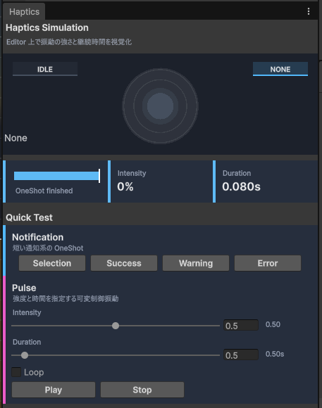
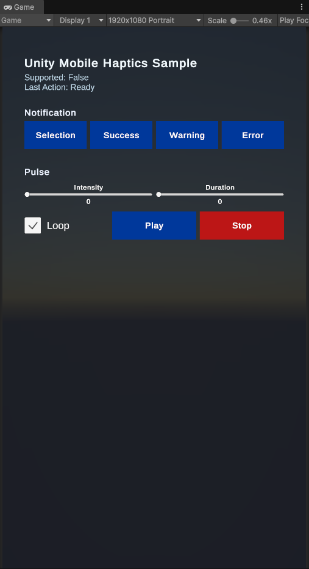

# unity-mobile-haptics

Unity のモバイル向けハプティクス再生ライブラリです。`iOS` と `Android` の差異を吸収し、同じ API で振動を再生できます。

## Features

- `MobileHaptics.Play(...)` で単発のネイティブハプティクスを再生
- `MobileHaptics.PlayPulse(...)` で強度と時間を指定する可変制御振動を再生
- `PlayPulse(..., loop: true)` の戻り値または `MobileHaptics.Stop()` で反復再生を停止
- `Selection` / `Success` / `Warning` / `Error` をサポート
- `UnityEditor` 上では Simulation Window で再生状態を視覚的に確認可能
- 未対応環境では安全に no-op として動作

## Requirements

- Unity `6000.0` 以降
- 対応プラットフォーム:
  - `iOS`
  - `Android`

## Installation

### Install via Package Manager

1. Unity の `Window > Package Manager` を開く
2. `+` ボタンから `Add package from git URL...` を選ぶ
3. 以下を入力してインストールする

```text
https://github.com/DaitokuAmy/unity-mobile-haptics.git?path=/Packages/com.daitokuamy.unitymobilehaptics
```

バージョンを指定する場合は末尾にタグを付けます。

```text
https://github.com/DaitokuAmy/unity-mobile-haptics.git?path=/Packages/com.daitokuamy.unitymobilehaptics#2.0.0
```

### Install via manifest.json

`Packages/manifest.json` の `dependencies` に以下を追加します。

```json
{
  "dependencies": {
    "com.daitokuamy.unitymobilehaptics": "https://github.com/DaitokuAmy/unity-mobile-haptics.git?path=/Packages/com.daitokuamy.unitymobilehaptics"
  }
}
```

## Quick Start

```csharp
using UnityEngine;
using UnityMobileHaptics;

public sealed class HapticsExample : MonoBehaviour {
    private HapticPlaybackHandle _loopHandle;

    public void PlaySuccess() {
        if (!MobileHaptics.IsSupported) {
            return;
        }

        MobileHaptics.Play(HapticType.Success);
    }

    public void PlayPulseLoop() {
        _loopHandle = MobileHaptics.PlayPulse(0.55f, 0.12f, true);
    }

    public void StopPulseLoop() {
        _loopHandle.Stop();
    }
}
```

## API

### `MobileHaptics`

```csharp
public static class MobileHaptics {
    public static bool IsSupported { get; }

    public static void Play(HapticType type);
    public static HapticPlaybackHandle PlayPulse(float intensity, float durationSeconds, bool loop = false);
    public static void Stop();
}

public readonly struct HapticPlaybackHandle {
    public bool IsValid { get; }

    public void Stop();
}
```

- `IsSupported`
  - 現在の実行環境でハプティクス再生に対応している場合は `true`
- `Play(HapticType type)`
  - 単発のネイティブハプティクスを再生
- `PlayPulse(float intensity, float durationSeconds, bool loop = false)`
  - 強度と時間を指定する可変制御振動を再生
  - `loop = true` の場合は同じ pulse を停止まで反復再生
- `Stop()`
  - 再生中の可変制御振動を停止
- `HapticPlaybackHandle`
  - `PlayPulse` が返す停止用ハンドル
  - 上書き再生後や再生完了後は無効化される

### `HapticType`

利用できる振動種別は以下です。

- `Selection`
- `Success`
- `Warning`
- `Error`

## Platform Notes

### iOS

- iOS 標準の `UIFeedbackGenerator` 系 API を利用します
- `PlayPulse` は `Core Haptics` が使えない環境でも動くよう近似再生を行います
- `loop = true` は無限振動 API ではなく、タイマーによる反復再生です
- アプリが非アクティブ化またはバックグラウンド遷移した場合は pulse を停止します

### Android

- Android 標準の `Vibrator` / `VibrationEffect` を利用します
- OS バージョンに応じて利用可能な API を切り替えます
- `PlayPulse` は振幅と再生時間を指定して動作します
- `loop = true` は waveform を使った継続再生、または近似動作で実装されます

### Unity Editor

- Editor 上では実機の物理振動は再現しません
- 代わりに Simulation Window で再生状態を視覚的に確認できます

## Editor Simulation

Unity メニューの `Window > Unity Mobile Haptics > Simulation` からシミュレーションウィンドウを開けます。

Runtime API を呼ぶと、このウィンドウに再生状態が反映されます。実機にデプロイする前の挙動確認や、UI 実装中の導線確認に便利です。



## Sample

このリポジトリにはサンプルシーンが含まれています。

- Scene: `Assets/Sample/Scenes/sample.unity`
- Script: `Assets/Sample/Scripts/HapticsSampleController.cs`

サンプルでは各 `HapticType` の単発再生、pulse 再生、loop 再生、停止をボタンから確認できます。



## License

This project is licensed under the MIT License. See `LICENSE.md` for details.
